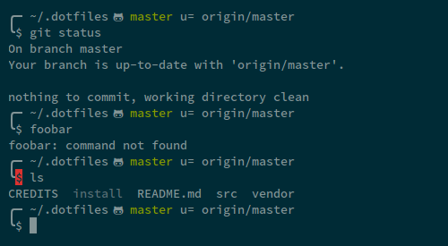

# gerardroche/dotfiles

My configuration files for bash, vim, git, and more. :zap: :zap:



## Installation

**All bets are off! Install at your own risk.**

```sh
git clone https://github.com/gerardroche/dotfiles.git ~/.dotfiles && ~/.dotfiles/install
```

## Thanks

See [CREDITS](CREDITS).

&lt;3
